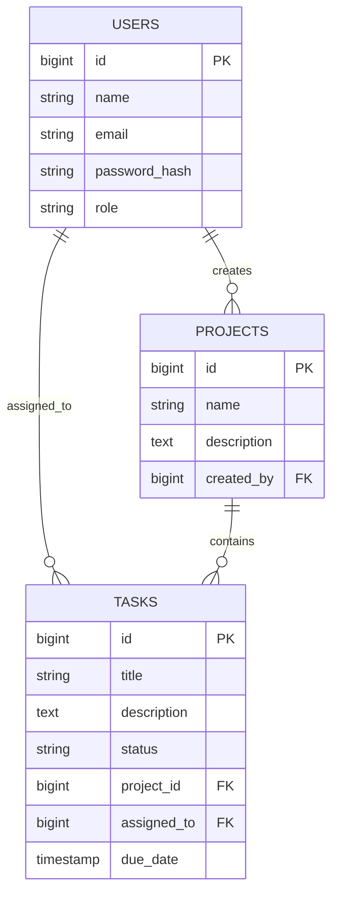

# Mini Project Management System

Full-stack machine task built with Golang, Gin, PostgreSQL, and Next.js. The backend is the focus, and the bonus items are included: Docker, RBAC, unit tests, layered/clean architecture, and OpenAPI-style Swagger documentation.

## Stack

- Backend: Golang + Gin + Gorm + PostgreSQL
- Frontend: Next.js 15
- Auth: JWT
- Migrations: `backend/migrations`
- API docs: `backend/docs/openapi.json`
- Postman collection: `docs/postman_collection.json`

## Deliverables

- JWT authentication with seeded admin login
- CRUD APIs for users, projects, and tasks
- Filtering and pagination for list endpoints
- Role-based access control
- PostgreSQL SQL migrations
- Docker setup for backend, frontend, and database
- OpenAPI JSON and Postman collection
- Unit tests for key service behavior
- Next.js dashboard for login, users, projects, tasks, and task assignment

## Architecture

The backend follows a clean, layered structure:

- `cmd/api`: application entrypoint
- `internal/config`: environment configuration
- `internal/database`: DB connection and default admin seed
- `internal/domain/entities`: core domain models
- `internal/domain/repositories`: repository interfaces
- `internal/repository/postgres`: PostgreSQL repository implementations
- `internal/domain/services`: business logic and RBAC-sensitive behavior
- `internal/handlers`: HTTP handlers
- `internal/middleware`: JWT auth and role checks
- `internal/router`: route registration and middleware wiring
- `internal/utils`: JWT, pagination, and shared error utilities

Request flow:

`HTTP -> Gin handler -> service -> repository -> PostgreSQL`

## ER Diagram



## Features Covered

- JWT login endpoint
- User create/list APIs
- Project create/list/update/delete APIs
- Task create/assign/update status/update/list APIs
- Minimal dashboard with user creation, project creation, task creation, and task assignment
- Pagination
- Filtering by project, status, and assigned user
- Validation and proper HTTP status codes
- Transaction usage in task creation
- Role-based access control
- Dockerized local setup
- Unit tests
- OpenAPI JSON for Swagger tooling

## RBAC Rules

- `admin`
  - Can create users, projects, and tasks
  - Can update/delete projects
  - Can assign tasks
  - Can update any task
- `developer`
  - Can log in
  - Can list users, projects, and tasks
  - Can update status only for tasks assigned to them

## API Summary

### Auth

- `POST /api/v1/auth/login`

### Users

- `POST /api/v1/users`
- `GET /api/v1/users?page=1&page_size=10`

### Projects

- `POST /api/v1/projects`
- `GET /api/v1/projects?page=1&page_size=10`
- `PUT /api/v1/projects/:id`
- `DELETE /api/v1/projects/:id`

### Tasks

- `POST /api/v1/tasks`
- `PATCH /api/v1/tasks/:id/assign`
- `PATCH /api/v1/tasks/:id/status`
- `PUT /api/v1/tasks/:id`
- `GET /api/v1/tasks?page=1&page_size=10&project_id=1&status=todo&assigned_to=2`

## Setup

### Option 1: Docker

1. From the repo root, run:

```bash
docker compose up --build
```

2. Services:

- Frontend: `http://localhost:3000`
- Backend: `http://localhost:8080`
- Health: `http://localhost:8080/health`
- OpenAPI JSON: `http://localhost:8080/swagger.json`

### Option 2: Manual Run

1. Create PostgreSQL database `techbrein_pm`.
2. Apply `backend/migrations/000001_init.up.sql`.
3. Copy `backend/.env.example` to `backend/.env` and adjust values if needed.
4. Run backend:

```bash
cd backend
go mod tidy
go run ./cmd/api
```

5. Run frontend:

```bash
cd frontend
npm install
npm run dev
```

Set `NEXT_PUBLIC_API_URL` before `npm run dev`.

- PowerShell: `$env:NEXT_PUBLIC_API_URL="http://localhost:8080/api/v1"`
- bash/zsh: `export NEXT_PUBLIC_API_URL="http://localhost:8080/api/v1"`

## Default Seeded Admin

- Email: `admin@techbrein.local`
- Password: `Admin@123`

The backend seeds this admin user on startup if it does not already exist.

## Testing

Backend unit tests:

```bash
cd backend
go test ./...
```

Frontend production build:

```bash
cd frontend
npm install
npm run build
```

Both backend tests and frontend build were verified in this workspace.

## Project Structure

```text
.
├── backend
│   ├── cmd/api
│   ├── docs
│   ├── internal
│   ├── migrations
│   └── tests
├── docs
│   └── postman_collection.json
├── frontend
│   ├── app
│   ├── components
│   └── lib
└── docker-compose.yml
```

## Notes

- `due_date` expects `YYYY-MM-DD`.
- The frontend stores the JWT in local storage for simplicity in a take-home setting.
- OpenAPI JSON can be imported into Swagger UI / Swagger Editor for interactive docs.
